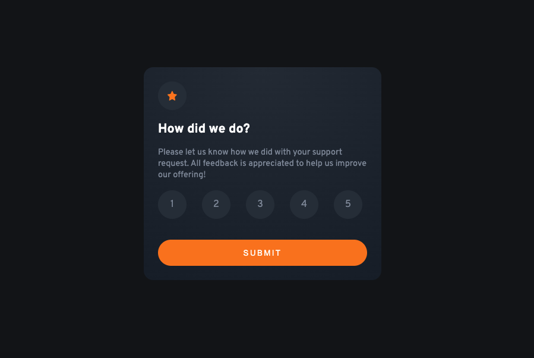

# Frontend Mentor - Interactive rating component


## Welcome! 👋

Thanks for checking out this front-end coding challenge.
## Table of contents

- [Overview](#overview)
  - [The challenge](#the-challenge)
  - [Screenshot](#screenshot)
  - [Links](#links)
- [My process](#my-process)
  - [Built with](#built-with)
  - [What I learned](#what-i-learned)
- [Author](#author)


## Overview

### The challenge

Users should be able to:

- View the optimal layout for the app depending on their device's screen size
- See hover states for all interactive elements on the page
- Select and submit a number rating
- See the "Thank you" card state after submitting a rating

### Screenshot




### Links

- Live Site URL: [Live Demo](https://)

## My process

### Built with

- Semantic HTML5 markup
- CSS custom properties
- Flexbox
- Mobile-first workflow


### What I learned

- CSS Animations & Animations
- Styling Radiobuttions
```css

.card-thanks{
    padding: 2rem;
    animation: fade-in 0.2s ease-in-out;
    -webkit-animation: fade-in 0.2s ease-in-out;
}

  
  @keyframes fade-in {
    from {
      transform: translateY(-30px);
      opacity: 0;
    }
  
    to {
      transform: translateY(0px);
      opacity: 1;
    }
  }
  
  @-webkit-keyframes fade-in {
    from {
      transform: translateY(-30px);
      opacity: 0;
    }
  
    to {
      transform: translateY(0px);
      opacity: 1;
    }
  }


  .card-rating__selector input {
    display: none;
  }
  
  .card-rating__selector input:checked ~ span {
    color: var(--white);
    background-color: var(--lightgrey);
  }
  
  .card-rating__selector input:hover ~ span {
    color: var(--white);
    background-color: var(--orange);
  }

```


## Author
- Frontend Mentor - [@Master-Osaro](https://www.frontendmentor.io/profile/yourusername)
- Twitter - [@iyoha_osaro](https://www.twitter.com/yourusername)
